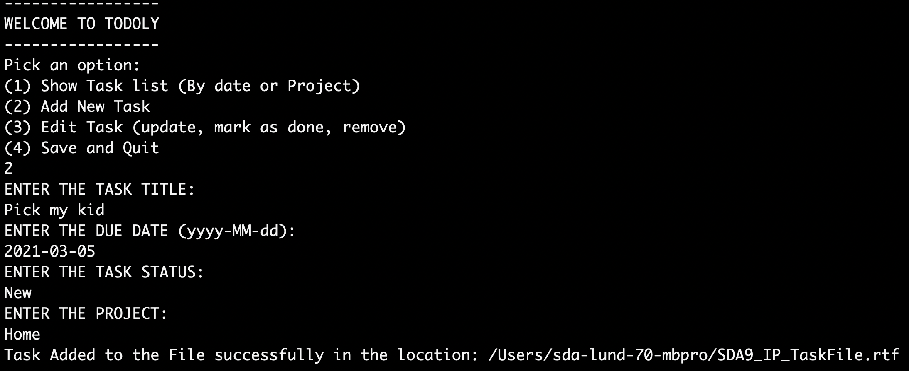
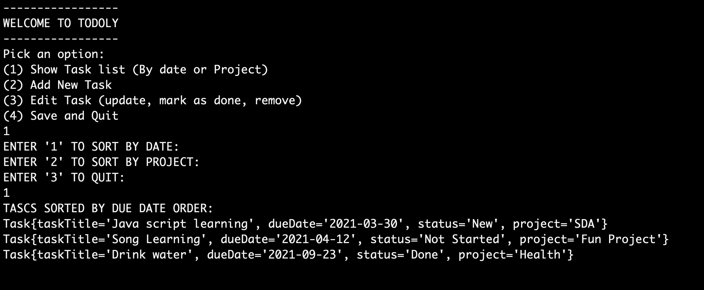
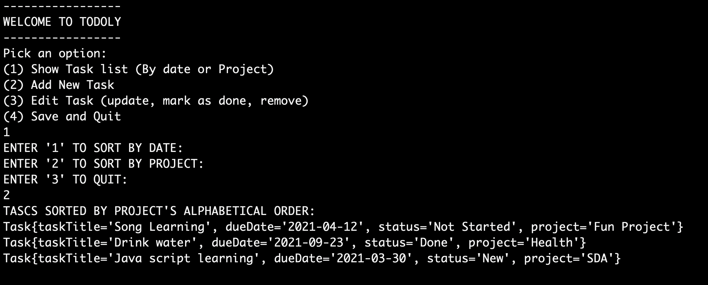
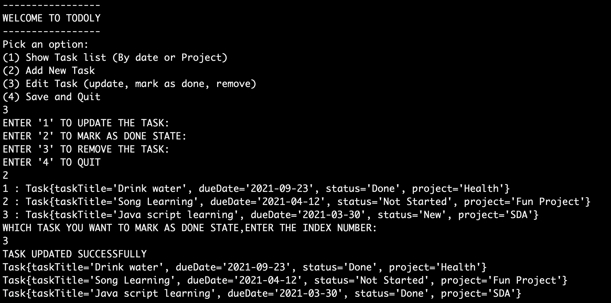

# To Do List App
This application simulates the ToDoList management system. It supports the user to create new tasks, update the existing tasks, 
remove the task and view the tasks.

## Getting Started
The application can be start by running a main program(ToDoListMain.java).Following are the different ways to generate the 
jar file and run the application.


### Run with jar file
Generate and run the jar using the below command

```bash
cd src/main/java
javac com/toDoList/*.java
jar cfm ToDoList.jar ../resources/MANIFEST.MF com/toDoList/*.class
```
The jar file will be generated in the java folder, which can be run by java environment.

```
java -jar ToDoListjar
```
### Run with Maven
In the root folder, run the below command, to generate the jar file.
```bash
mvn clean install
```
The jar file will be generated in the target folder, which can be run by java environment.
```
java -jar target/ToDoList.jar
```

## Usage of ToDoList App
Open the Terminal and enter the below command to run the jar file.
```
java -jar target/ToDoList.jar
```
You are able to add a new Task in the ToDoList app by selecting the Option 2 and provide all the task details:



You are able to view the task by date order or project order by selecting the Option 1





You are able to edit task by selecting the Option 3

